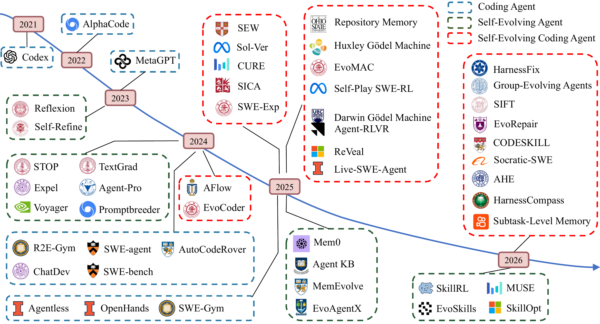
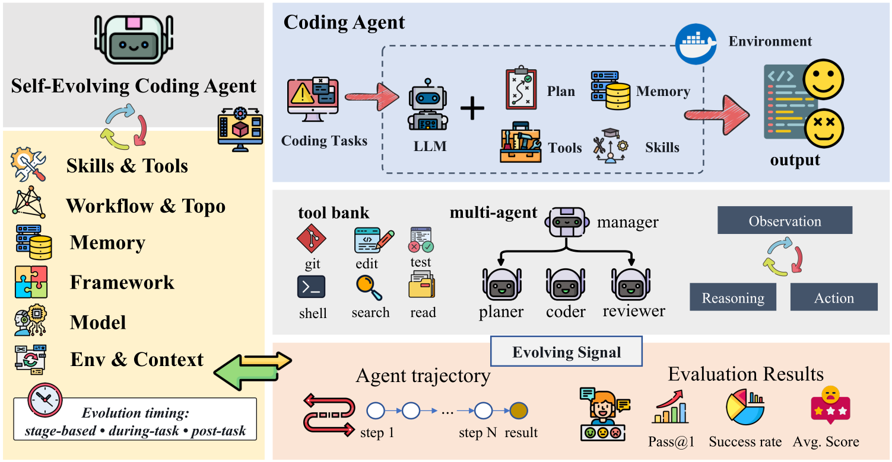

<div align="center">

<h1>Self-Evolving Coding Agents</h1>

<p>
  <a href="https://github.com/sindresorhus/awesome">
    
  </a>
  <a href="https://arxiv.org/abs/2608.03392">
    
  </a>
  <a href="https://github.com/zhouhao1024/Awesome-Self-Evolving-Coding-Agents/issues">
    
  </a>
  <a href="https://github.com/zhouhao1024/Awesome-Self-Evolving-Coding-Agents/stargazers">
    
  </a>
  <a href="https://github.com/zhouhao1024/Awesome-Self-Evolving-Coding-Agents/commits">
    
  </a>
</p>

</div>

<p align="center">
  
</p>

<a id="introduction"></a>

## 📖 Introduction

<p align="center">
  
</p>
<p align="center"><em>Overview of self-evolving coding agents.</em></p>

Coding agents increasingly learn from execution outcomes, trajectories, accumulated experience, and environmental feedback, improving the persistent components of their own software-engineering workflow. This repository accompanies our survey and curates its paper corpus, related methods, benchmarks, products, and related surveys. Self-evolving systems are organized into three layers: **assets** (memory, skills, tools, context), **architecture** (harness, workflow, multi-agent structures), and **model weights**.

<a id="scope"></a>

## 🎯 Scope

This repository covers five groups of resources:

1. **Self-Evolving Coding Agents**: curated systems organized by which part of the agent gets modified: assets (memory, skills, tools, context), architecture (harness, workflow, topology), or model weights.

2. **General Self-Evolution Methods in Coding Settings**: General agent self-evolution methods whose improvements are evaluated on code generation, program execution, or software engineering tasks.

3. **Benchmarks and Empirical Studies**: Conventional benchmarks for repository-level software engineering and general coding, dedicated benchmarks for agent self-evolution, and empirical studies of coding-agent self-evolution.

4. **Products**: deployed coding products with persistent adaptation mechanisms, mapped to the same target vocabulary.

5. **Related Surveys**: surveys covering self-evolving agents, coding agents, and their intersection.

<a id="contents"></a>

## 🌐 Contents

- [Introduction](#introduction)
- [Scope](#scope)
- [1. Self-Evolving Coding Agents](#1-self-evolving-coding-agents)
  - [1.1 Assets Self-Evolution](#11-assets-self-evolution)
    - [1.1.1 Memory Self-Evolution](#111-memory-self-evolution)
    - [1.1.2 Skill Self-Evolution](#112-skill-self-evolution)
    - [1.1.3 Tool Self-Evolution](#113-tool-self-evolution)
    - [1.1.4 Context Self-Evolution](#114-context-self-evolution)
  - [1.2 Architecture Self-Evolution](#12-architecture-self-evolution)
    - [1.2.1 Harness Evolution](#121-harness-evolution)
    - [1.2.2 Workflow Evolution](#122-workflow-evolution)
    - [1.2.3 Multi-Agent Evolution](#123-multi-agent-evolution)
  - [1.3 Model Self-Evolution](#13-model-self-evolution)
    - [1.3.1 Self-Play Co-Evolution](#131-self-play-co-evolution)
    - [1.3.2 Environment-Reward RL](#132-environment-reward-rl)
    - [1.3.3 Harness Co-Evolution](#133-harness-co-evolution)
- [3. Benchmarks and Empirical Studies](#3-benchmarks-and-empirical-studies)
  - [3.1 Repository-Level Software Engineering Benchmarks](#31-repository-level-software-engineering-benchmarks)
  - [3.2 General Coding Benchmarks](#32-general-coding-benchmarks)
  - [3.3 Self-Evolution Benchmarks](#33-self-evolution-benchmarks)
  - [3.4 Empirical Studies](#34-empirical-studies)
- [4. Self-Evolving Coding Products](#4-self-evolving-coding-products)
- [5. Related Surveys](#5-related-surveys)
  - [5.1 Surveys on Self-Evolving Agents](#51-surveys-on-self-evolving-agents)
  - [5.2 Surveys on Coding Agents](#52-surveys-on-coding-agents)

<a id="1-self-evolving-coding-agents"></a>

## 🤖 1. Self-Evolving Coding Agents

### 1.1 Assets Self-Evolution

#### 1.1.1 Memory Self-Evolution

##### 1.1.1.1 Experience-Derived Memory

1. [Self-Abstraction from Grounded Experience for Plan-Guided Policy Refinement (SAGE)](https://arxiv.org/abs/2511.05931) `[2025-arXiv]`
2. [SWE-Exp: Experience-Driven Software Issue Resolution](https://arxiv.org/abs/2507.23361) `[2025-arXiv]` · [\[Code\]](https://github.com/cslsolow/SWE-Exp)
3. [LLMs as Continuous Learners: Improving the Reproduction of Defective Code in Software Issues (EvoCoder)](https://arxiv.org/abs/2411.13941) `[2024-arXiv]`
4. [Structurally Aligned Subtask-Level Memory for Software Engineering Agents (Subtask Memory)](https://arxiv.org/abs/2602.21611) `[2026-arXiv]`
5. [EvoRepair: Enhancing Vulnerability Repair Agents Through Experience-Based Self-Evolution](https://arxiv.org/abs/2605.30105) `[2026-arXiv]`
6. [Coupling Planning with Episodic Memory in LLM Agents for Software Issue Resolution (PMCoder)](https://arxiv.org/abs/2608.06811) `[2026-arXiv]`
7. [EXPEREPAIR: Dual-Memory Enhanced LLM-based Repository-Level Program Repair](https://arxiv.org/abs/2506.10484) `[2026-FSE]` · [\[Code\]](https://github.com/ExpeRepair/ExpeRepair)
8. [VeriAgent: A Tool-Integrated Multi-Agent System with Evolving Memory for PPA-Aware RTL Code Generation](https://arxiv.org/abs/2603.17613) `[2026-arXiv]`
9. [MemRepair: Hierarchical Memory for Agentic Repository-Level Vulnerability Repair](https://arxiv.org/abs/2605.17444) `[2026-arXiv]`
10. [ReasoningBank: Scaling Agent Self-Evolving with Reasoning Memory](https://arxiv.org/abs/2509.25140) `[2026-ICLR]` · [\[Code\]](https://github.com/google-research/reasoning-bank)
11. [Reflexion: Language Agents with Verbal Reinforcement Learning](https://arxiv.org/abs/2303.11366) `[2023-NeurIPS]` · [\[Code\]](https://github.com/noahshinn/reflexion)
12. [SE-Agent: Self-Evolution Trajectory Optimization in Multi-Step Reasoning with LLM-Based Agents](https://arxiv.org/abs/2508.02085) `[2025-NeurIPS]` · [\[Code\]](https://github.com/JARVIS-Xs/SE-Agent)
13. [Agent KB: Leveraging Cross-Domain Experience for Agentic Problem Solving](https://arxiv.org/abs/2507.06229) `[2025-ICML Workshop]` · [\[Code\]](https://github.com/OPPO-PersonalAI/Agent-KB)
14. [Adaptive Self-improvement LLM Agentic System for ML Library Development](https://arxiv.org/abs/2502.02534) `[2025-ICML]` · [\[Code\]](https://github.com/zhang677/PCL-lite)
15. [PILOT in the Loop: Live Self-Improvement for Long-Horizon Agents](https://arxiv.org/abs/2608.26530) `[2026-arXiv]`
16. [SWE-MeM: Learning Adaptive Memory Management for Long-Horizon Coding Agents](https://arxiv.org/abs/2606.28434) `[2026-arXiv]`
17. [From Knowledge to Noise: CTIM-Rover and the Pitfalls of Episodic Memory in Software Engineering Agents](https://aclanthology.org/2025.realm-1.30/) `[2025-REALM]` · [\[Code\]](https://github.com/Liqs-v2/ctim-rover)

##### 1.1.1.2 External Knowledge Memory

1. [Improving Code Localization with Repository Memory](https://arxiv.org/abs/2510.01003) `[2026-ICLR]`
2. [Your Code Agent Can Grow Alongside You with Structured Memory (MemCoder)](https://arxiv.org/abs/2603.13258) `[2026-arXiv]`
3. [Learning to Commit: Generating Organic Pull Requests via Online Repository Memory](https://arxiv.org/abs/2603.26664) `[2026-arXiv]`
4. [Self-Improving AI Coding Agents Through Accumulated Behavioral Rules: A Closed-Loop Framework](https://arxiv.org/abs/2607.13091) `[2026-IEEE ICE]`

#### 1.1.2 Skill Self-Evolution

##### 1.1.2.1 Skill Acquisition

1. [CODESKILL: Learning Self-Evolving Skills for Coding Agents](https://arxiv.org/abs/2605.25430) `[2026-arXiv]`
2. [Automatically Learning Skills for Coding Agents (GSkill)](https://doi.org/10.1145/3786335.3813196) `[2026-ACM CAIS]`
3. [Socratic-SWE: Self-Evolving Coding Agents via Trace-Derived Agent Skills](https://arxiv.org/abs/2606.07412) `[2026-arXiv]`
4. [Learning Globally Reusable Skills for Coding Agents (GSE)](https://arxiv.org/abs/2608.06153) `[2026-arXiv]`
5. [SkillForge: Self-Distilling Agents for Project-Specific Issue Resolution](https://arxiv.org/abs/2608.18933) `[2026-arXiv]` · [\[Code\]](https://github.com/cslsolow/SkillForge)
6. [Verilog-Evolve: Feedback-Driven and Skill-Evolving Verilog Generation](https://arxiv.org/abs/2605.26498) `[2026-arXiv]` · [\[Code\]](https://github.com/Hui-Ling-Zhen/verilog_evolve)
7. [Trace2Skill: Verifier-Guided Skill Evolution for Long-Context EDA Agents](https://arxiv.org/abs/2605.21810) `[2026-arXiv]`
8. [From Procedural Skills to Strategy Genes: Towards Experience-Driven Test-Time Evolution](https://arxiv.org/abs/2604.15097) `[2026-arXiv]` · [\[Code\]](https://github.com/EvoMap/skill2gep)

##### 1.1.2.2 Skill Optimization

1. [EffiSkill: Agent Skill Based Automated Code Efficiency Optimization](https://arxiv.org/abs/2603.27850) `[2026-arXiv]`
2. [Do Personalized Skills Help Coding Agents? An Empirical Study of Developer Interaction Histories](https://arxiv.org/abs/2608.10319) `[2026-arXiv]`
3. [SkillMOO: Multi-objective Optimization of Agent Skills for Software Engineering](https://arxiv.org/abs/2604.09297) `[2026-ASE]` · [\[Code\]](https://github.com/gjz78910/SkillMOO)
4. [daVinci-kernel: Co-Evolving Skill Selection, Summarization, and Utilization via RL for GPU Kernel Optimization](https://arxiv.org/abs/2606.16497) `[2026-arXiv]` · [\[Code\]](https://github.com/GAIR-NLP/daVinci-kernel)

##### 1.1.2.3 Skill Governance

1. [Ratchet: How Reliable Must an LLM Judge Be to Retire a Skill?](https://arxiv.org/abs/2605.22148) `[2026-arXiv]` · [\[Code\]](https://github.com/amazon-science/Self-Evolving-Agents-Ratchet)
2. [SkillsVote: Lifecycle Governance of Agent Skills from Collection, Recommendation to Evolution](https://arxiv.org/abs/2605.18401) `[2026-arXiv]` · [\[Code\]](https://github.com/MemTensor/skills-vote)
3. [Who Grades the Grader? Co-Evolving Evaluation Metrics and Skills for Self-Improving LLM Agents](https://arxiv.org/abs/2607.12790) `[2026-arXiv]` · [\[Code\]](https://github.com/amazon-science/Self-Evolving-Agents-Double-Ratchet)

##### 1.1.2.4 Skill Safety

1. [Library Drift: Diagnosing and Fixing a Silent Failure Mode in Self-Evolving LLM Skill Libraries](https://arxiv.org/abs/2605.19576) `[2026-arXiv]` · [\[Code\]](https://github.com/amazon-science/Self-Evolving-Agents-Ratchet)
2. [When Self-Evolution Backfires: Pre-Commit Gating against Skill Contamination in LLM Agents](https://arxiv.org/abs/2608.05810) `[2026-arXiv]`
3. [EVOMAL: Self-Poisoning in Self-Evolving Coding Agents](https://arxiv.org/abs/2608.25776) `[2026-arXiv]`

#### 1.1.3 Tool Self-Evolution

1. [Live-SWE-agent: Can Software Engineering Agents Self-Evolve on the Fly?](https://arxiv.org/abs/2511.13646) `[2025-arXiv]` · [\[Code\]](https://github.com/OpenAutoCoder/live-swe-agent)
2. [SIGA: Self-Evolving Coding-Agent Adapters for Scientific Simulation](https://arxiv.org/abs/2606.09774) `[2026-arXiv]`

#### 1.1.4 Context Self-Evolution

##### 1.1.4.1 Context Retrieval

1. [EVOR: Evolving Retrieval for Code Generation](https://arxiv.org/abs/2402.12317) `[2024-EMNLP Findings]` · [\[Code\]](https://github.com/xlang-ai/EVOR)
2. [CodeMEM: AST-Guided Adaptive Memory for Repository-Level Iterative Code Generation](https://arxiv.org/abs/2601.02868) `[2026-ACL Findings]` · [\[Code\]](https://github.com/zhu-zhu-ding/CodeMEM)

##### 1.1.4.2 Context Compression

1. [A Self-Evolving Framework for Efficient Terminal Agents via Observational Context Compression (TACO)](https://arxiv.org/abs/2604.19572) `[2026-arXiv]` · [\[Code\]](https://github.com/multimodal-art-projection/TACO)
2. [SWE-Pruner: Self-Adaptive Context Pruning for Coding Agents](https://arxiv.org/abs/2601.16746) `[2026-arXiv]` · [\[Code\]](https://github.com/Ayanami1314/swe-pruner)

##### 1.1.4.3 Prompt Evolution

1. [Automated Prompt Engineering for Cost-Effective Code Generation Using Evolutionary Algorithm (EPiC)](https://arxiv.org/abs/2408.11198) `[2026-TOSEM]` · [\[Code\]](https://github.com/HamedTaherkhani/EPiC)
2. [Prompt Optimization for LLM Code Generation via Reinforcement Learning](https://arxiv.org/abs/2605.19102) `[2026-arXiv]`
3. [SePO: Self-Evolving Prompt Agent for System Prompt Optimization](https://arxiv.org/abs/2606.04465) `[2026-arXiv]`
4. [From Failing to Passing: Evolving Natural Language Prompt Optimization Rules for LLM Code Generation](https://arxiv.org/abs/2607.05121) `[2026-arXiv]`

##### 1.1.4.4 Environment Evolution

1. [Libra: Training the Environment for Agentic Information Retrieval](https://arxiv.org/abs/2607.00016) `[2026-arXiv]` · [\[Code\]](https://github.com/salesforce-misc/Libra)
2. [Learning to Build the Environment: Self-Evolving Reasoning RL via Verifiable Environment Synthesis (EvoEnv)](https://arxiv.org/abs/2605.14392) `[2026-arXiv]`

### 1.2 Architecture Self-Evolution

#### 1.2.1 Harness Evolution

##### 1.2.1.1 Archive-Based Evolution

1. [Darwin Gödel Machine: Open-Ended Evolution of Self-Improving Agents (DGM)](https://arxiv.org/abs/2505.22954) `[2026-ICLR]` · [\[Code\]](https://github.com/jennyzzt/dgm)
2. [Mendel Gödel Machine: Comparative Evolution Enables State-of-the-Art Self-Improving Coding Agents (Mendel GM)](https://openreview.net/forum?id=EJ7gBBDvCg) `[2026-OpenReview]` · [\[Code\]](https://github.com/RealLcz/MGM)
3. [Huxley Gödel Machine: Human-Level Coding Agent Development by an Approximation of the Optimal Self-Improving Machine (Huxley GM)](https://arxiv.org/abs/2510.21614) `[2026-ICLR]` · [\[Code\]](https://github.com/metauto-ai/HGM)
4. [Self-Improvement via Fast Tree-Search (SIFT)](https://openreview.net/forum?id=wZMNXHPYcO) `[2026-ICLR]`
5. [The Red Queen Gödel Machine: Co-Evolving Agents and Their Evaluators (RQGM)](https://arxiv.org/abs/2606.26294) `[2026-arXiv]`
6. [HyperAgents](https://arxiv.org/abs/2603.19461) `[2026-arXiv]` · [\[Code\]](https://github.com/facebookresearch/HyperAgents)

##### 1.2.1.2 Iteration-Based Evolution

1. [A Self-Improving Coding Agent (SICA)](https://arxiv.org/abs/2504.15228) `[2025-ICLR]` · [\[Code\]](https://github.com/MaximeRobeyns/self_improving_coding_agent)
2. [Self-Taught Optimizer (STOP): Recursively Self-Improving Code Generation](https://arxiv.org/abs/2310.02304) `[2024-COLM]` · [\[Code\]](https://github.com/microsoft/stop)
3. [Ouroboros: A Self-Developing Frontier Coding Agent with Reviewed Core Evolution](https://arxiv.org/abs/2608.08311) `[2026-arXiv]` · [\[Code\]](https://github.com/razzant/ouroboros)

##### 1.2.1.3 Trace-Driven Evolution

1. [Self-Harness: Harnesses That Improve Themselves](https://arxiv.org/abs/2606.09498) `[2026-arXiv]` · [\[Code\]](https://github.com/qzzqzzb/Self-Harness)
2. [AutoSaddler: Automatic Harness Optimization with Durable Updates from Agent Execution Traces](https://arxiv.org/abs/2608.23041) `[2026-arXiv]` · [\[Code\]](https://github.com/microsoft/AutoSaddler)
3. [Evo-Harness: Context-to-Harness Skill Compilation for Self-Evolving Agents](https://arxiv.org/abs/2608.15071) `[2026-arXiv]` · [\[Code\]](https://github.com/A-EVO-Lab/a-evolve/tree/release/evo-harness)
4. [Agentic Harness Engineering: Observability-Driven Automatic Evolution of Coding-Agent Harnesses (AHE)](https://arxiv.org/abs/2604.25850) `[2026-arXiv]` · [\[Code\]](https://github.com/china-qijizhifeng/agentic-harness-engineering)
5. [From Failed Trajectories to Reliable LLM Agents: Diagnosing and Repairing Harness Flaws (HarnessFix)](https://arxiv.org/abs/2606.06324) `[2026-arXiv]` · [\[Code\]](https://github.com/HarnessFix/HarnessFix)
6. [ReCreate: Reasoning and Creating Domain Agents Driven by Experience](https://aclanthology.org/2026.acl-long.1432/) `[2026-ACL]` · [\[Code\]](https://github.com/zz-haooo/ReCreate)
7. [Harness-of-Harness: Multi-Day Autonomous Software Development with Continual Improvement](https://arxiv.org/abs/2609.01481) `[2026-arXiv]` · [\[Code\]](https://github.com/Flesymeb/HarnessOfHarness)
8. [One Recipe, Many Harnesses: What Self-Evolution Encodes Across Languages and Models](https://arxiv.org/abs/2608.10178) `[2026-arXiv]`

##### 1.2.1.4 Population-Based Search

1. [DarwinX: Evolving Agent Harnesses Through Natural Selection](https://arxiv.org/abs/2608.07545) `[2026-arXiv]`
2. [HarnessBank: Semantic Gene-Bank Search with Gated Verification for Agent-Harness Self-Evolution](https://arxiv.org/abs/2607.13683) `[2026-arXiv]`
3. [EvolveNet: Collaborative Harness Evolution for Agent Self-Improvement](https://arxiv.org/abs/2608.04968) `[2026-arXiv]` · [\[Code\]](https://github.com/junnie00/EvolveNet)
4. [HarnessCompass: Guiding Automatic Harness Evolution toward Generalizable and Effective Agent Harnesses](https://arxiv.org/abs/2608.01918) `[2026-arXiv]`
5. [Automated Design of Agentic Systems (ADAS)](https://arxiv.org/abs/2408.08435) `[2025-ICLR]` · [\[Code\]](https://github.com/ShengranHu/ADAS)

##### 1.2.1.5 Pipeline-Driven Evolution

1. [Meta-Harness: End-to-End Optimization of Model Harnesses](https://arxiv.org/abs/2603.28052) `[2026-arXiv]` · [\[Code\]](https://github.com/stanford-iris-lab/meta-harness)
2. [AgentDevel: Reframing Self-Evolving LLM Agents as Release Engineering](https://arxiv.org/abs/2601.04620) `[2026-arXiv]`
3. [HarnessX: A Composable, Adaptive, and Evolvable Agent Harness Foundry](https://arxiv.org/abs/2606.14249) `[2026-arXiv]` · [\[Code\]](https://github.com/Darwin-Agent/HarnessX)
4. [Confucius Code Agent: Scalable Agent Scaffolding for Real-World Codebases (CCA)](https://arxiv.org/abs/2512.10398) `[2025-arXiv]` · [\[Code\]](https://github.com/facebookresearch/cca-swebench)
5. [Autogenesis: A Self-Evolving Agent Protocol](https://arxiv.org/abs/2604.15034) `[2026-arXiv]` · [\[Code\]](https://github.com/DVampire/Autogenesis)
6. [Self-Evolving Agents with Anytime-Valid Certificates (SEA)](https://arxiv.org/abs/2607.00871) `[2026-arXiv]`

##### 1.2.1.6 Runtime Evolution

1. [TTHE: Test-Time Harness Evolution](https://arxiv.org/abs/2607.08124) `[2026-arXiv]` · [\[Code\]](https://github.com/junnie00/TTHE)
2. [Adapting the Interface, Not the Model: Runtime Harness Adaptation for Deterministic LLM Agents (Life-Harness)](https://arxiv.org/abs/2605.22166) `[2026-arXiv]` · [\[Code\]](https://github.com/Tianshi-Xu/Life-Harness)
3. [Argus: A General-Purpose Agentic Reasoning Runtime for Long-Horizon Tasks](https://arxiv.org/abs/2608.05144) `[2026-arXiv]` · [\[Code\]](https://github.com/microsoft/ArgusAgent)

#### 1.2.2 Workflow Evolution

1. [AFlow: Automating Agentic Workflow Generation](https://arxiv.org/abs/2410.10762) `[2025-ICLR]` · [\[Code\]](https://github.com/FoundationAgents/AFlow)
2. [SEW: Self-Evolving Agentic Workflows for Automated Code Generation](https://arxiv.org/abs/2505.18646) `[2025-arXiv]` · [\[Code\]](https://github.com/ANative-Lab/EvoAgentX)
3. [EvoFlow: Evolving Diverse Agentic Workflows On The Fly](https://arxiv.org/abs/2502.07373) `[2025-arXiv]`
4. [EvoAgentX: An Automated Framework for Evolving Agentic Workflows](https://arxiv.org/abs/2507.03616) `[2025-EMNLP Demos]` · [\[Code\]](https://github.com/ANative-Lab/EvoAgentX)
5. [FlowEvo: Self-Evolving Agents through the Co-Evolution of Workflows and Executable Skills](https://arxiv.org/abs/2607.21596) `[2026-arXiv]` · [\[Code\]](https://github.com/DEFENSE-SEU/FlowEvo)
6. [JUDGEFLOW: Agentic Workflow Optimization via Block Judge](https://arxiv.org/abs/2601.07477) `[2026-arXiv]`

#### 1.2.3 Multi-Agent Evolution

1. [Self-Evolving Multi-Agent Collaboration Networks for Software Development (EvoMAC)](https://arxiv.org/abs/2410.16946) `[2025-ICLR]` · [\[Code\]](https://github.com/MASWorks/MASLab/tree/main/methods/evomac)
2. [AgentConductor: Topology Evolution for Multi-Agent Competition-Level Code Generation](https://arxiv.org/abs/2602.17100) `[2026-ICML]`
3. [SEMAG: Self-Evolutionary Multi-Agent Code Generation](https://arxiv.org/abs/2603.15707) `[2026-arXiv]`
4. [Group-Evolving Agents: Open-Ended Self-Improvement via Experience Sharing (GEA)](https://arxiv.org/abs/2602.04837) `[2026-arXiv]` · [\[Code\]](https://github.com/UCSB-AI/GEA)
5. [SAGE: Multi-Agent Self-Evolution for LLM Reasoning](https://arxiv.org/abs/2603.15255) `[2026-arXiv]`
6. [Evolve as a Team: Collaborative Self-Evolution for LLM-Based Multi-Agent Systems](https://arxiv.org/abs/2605.29790) `[2026-arXiv]` · [\[Code\]](https://github.com/zz-haooo/Meta-Team)

### 1.3 Model Self-Evolution

#### 1.3.1 Self-Play Co-Evolution

1. [Toward Training Superintelligent Software Agents through Self-Play SWE-RL](https://arxiv.org/abs/2512.18552) `[2026-ICML]`
2. [ReVeal: Self-Evolving Code Agents via Iterative Generation-Verification](https://arxiv.org/abs/2506.11442) `[2026-ICLR]` · [\[Code\]](https://github.com/Shimly-2/ReVeal)
3. [CURE: Co-Evolving LLM Coder and Unit Tester via Reinforcement Learning](https://arxiv.org/abs/2506.03136) `[2025-NeurIPS]` · [\[Code\]](https://github.com/Gen-Verse/CURE)
4. [ZeroCoder: Can LLMs Improve Code Generation Without Ground-Truth Supervision?](https://arxiv.org/abs/2604.07864) `[2026-arXiv]`
5. [Learning to Solve and Verify: A Self-Play Framework for Code and Test Generation (Sol-Ver)](https://arxiv.org/abs/2502.14948) `[2025-NeurIPS]`
6. [ACE: Self-Evolving LLM Coding Framework via Adversarial Unit Test Generation and Preference Optimization](https://arxiv.org/abs/2605.16299) `[2026-arXiv]`
7. [Anchored Self-Play for Code Repair](https://arxiv.org/abs/2607.03523) `[2026-ICML]`
8. [Absolute Zero: Reinforced Self-Play Reasoning with Zero Data](https://arxiv.org/abs/2505.03335) `[2025-NeurIPS]` · [\[Code\]](https://github.com/LeapLabTHU/Absolute-Zero-Reasoner)
9. [OPD-Evolver: Cultivating Holistic Agent Evolver via On-Policy Distillation](https://arxiv.org/abs/2606.17628) `[2026-arXiv]` · [\[Code\]](https://github.com/bingreeky/opd-evolver)

#### 1.3.2 Environment-Reward RL

1. [Agent-RLVR: Training Software Engineering Agents via Guidance and Environment Rewards](https://arxiv.org/abs/2506.11425) `[2026-ICLR]`
2. [SWE-RL: Advancing LLM Reasoning via Reinforcement Learning on Open Software Evolution](https://arxiv.org/abs/2502.18449) `[2025-NeurIPS]` · [\[Code\]](https://github.com/facebookresearch/swe-rl)
3. [Self-Improving Language Models for Evolutionary Program Synthesis: A Case Study on ARC-AGI (SOAR)](https://arxiv.org/abs/2507.14172) `[2025-ICML]` · [\[Code\]](https://github.com/flowersteam/SOAR)

#### 1.3.3 Harness Co-Evolution

1. [Harness-R1: Learning to Edit Executable Runtime Harnesses from Agent Failure Trajectories](https://arxiv.org/abs/2608.02276) `[2026-arXiv]` · [\[Code\]](https://github.com/DeepExperience/Harness-R1)
2. [HELIX: Model-Harness Co-evolution for Recursive Self-Improvement](https://arxiv.org/abs/2608.13951) `[2026-arXiv]` · [\[Code\]](https://github.com/HKUDS/HELIX)

<a id="3-benchmarks-and-empirical-studies"></a>

## 📊 3. Benchmarks and Empirical Studies

This section brings together **repository-level software engineering benchmarks** and **general coding benchmarks** to assess coding capabilities, **self-evolution benchmarks** to evaluate agents' ability to improve themselves, and **empirical studies** to examine the performance gains, computational costs, and failure modes of self-evolving coding agents.

### 3.1 Repository-Level Software Engineering Benchmarks

1. [SWE-bench: Can Language Models Resolve Real-World GitHub Issues?](https://arxiv.org/abs/2310.06770) `[2024-ICLR]`
2. [SWE-Bench Pro: Can AI Agents Solve Long-Horizon Software Engineering Tasks?](https://arxiv.org/abs/2509.16941) `[2026-ICML]`
3. [SWE-EVO: Benchmarking Coding Agents in Long-Horizon Software Evolution Scenarios](https://arxiv.org/abs/2512.18470) `[2025-arXiv]`
4. [SWE-bench Multimodal: Do AI Systems Generalize to Visual Software Domains?](https://arxiv.org/abs/2410.03859) `[2025-ICLR]`
5. [Multi-SWE-bench: A Multilingual Benchmark for Issue Resolving](https://arxiv.org/abs/2504.02605) `[2025-NeurIPS Datasets and Benchmarks]`
6. [SWE-PolyBench: A Multi-Language Benchmark for Repository Level Evaluation of Coding Agents](https://arxiv.org/abs/2504.08703) `[2025-arXiv]`
7. [SWE-bench Goes Live! (SWE-bench-Live)](https://arxiv.org/abs/2505.23419) `[2025-NeurIPS Datasets and Benchmarks]`
8. [SWE-bench Multilingual](https://www.swebench.com/multilingual.html) `[2025-Benchmark]`
9. [BeyondSWE: Can Current Code Agent Survive Beyond Single-Repo Bug Fixing?](https://arxiv.org/abs/2603.03194) `[2026-arXiv]`
10. [LoCoBench: A Benchmark for Long-Context Large Language Models in Complex Software Engineering](https://arxiv.org/abs/2509.09614) `[2025-arXiv]`
11. [CoderEval: A Benchmark of Pragmatic Code Generation with Generative Pre-trained Models](https://arxiv.org/abs/2302.00288) `[2024-ICSE]`
12. [DevEval: A Manually-Annotated Code Generation Benchmark Aligned with Real-World Code Repositories](https://aclanthology.org/2024.findings-acl.214/) `[2024-ACL Findings]`
13. [SWE-QA: Can Language Models Answer Repository-level Code Questions?](https://aclanthology.org/2026.findings-acl.402/) `[2026-ACL Findings]`
14. [LongCodeBench: Evaluating Coding LLMs at 1M Context Windows](https://arxiv.org/abs/2505.07897) `[2025-COLM]`
15. [CRUST-Bench: A Comprehensive Benchmark for C-to-safe-Rust Transpilation](https://arxiv.org/abs/2504.15254) `[2025-COLM]`
16. [PATCHEVAL: A New Benchmark for Evaluating LLMs on Patching Real-World Vulnerabilities](https://arxiv.org/abs/2511.11019) `[2025-arXiv]`
17. [SEC-bench: Automated Benchmarking of LLM Agents on Real-World Software Security Tasks](https://arxiv.org/abs/2506.11791) `[2025-NeurIPS]`
18. [Vul4J: A Dataset of Reproducible Java Vulnerabilities Geared Towards the Study of Program Repair Techniques](https://doi.org/10.1145/3524842.3528482) `[2022-MSR]`
19. [CRAVE: Code Review Agent Verdict Evaluation](https://huggingface.co/datasets/TuringEnterprises/CRAVE) `[2025-Dataset]`
20. [Self-Evolving Multi-Agent Collaboration Networks for Software Development (rSDE-Bench)](https://arxiv.org/abs/2410.16946) `[2025-ICLR]`
21. [GameCraft-Bench: Can Agents Build Playable Games End-to-End in a Real Game Engine?](https://arxiv.org/abs/2606.17861) `[2026-arXiv]`
22. [ProgramBench: Can Language Models Rebuild Programs From Scratch?](https://arxiv.org/abs/2605.03546) `[2026-arXiv]`
23. [FrontierSWE](https://www.frontierswe.com/blog/v1) `[2026-Benchmark]`
24. [CompileBench: Can AI Compile 22-year-old Code?](https://quesma.com/blog/introducing-compilebench/) `[2025-Benchmark]`

### 3.2 General Coding Benchmarks

1. [Evaluating Large Language Models Trained on Code (HumanEval)](https://arxiv.org/abs/2107.03374) `[2021-arXiv]`
2. [Program Synthesis with Large Language Models (MBPP)](https://arxiv.org/abs/2108.07732) `[2021-arXiv]`
3. [Measuring Coding Challenge Competence with APPS](https://arxiv.org/abs/2105.09938) `[2021-NeurIPS Datasets and Benchmarks]`
4. [Competition-Level Code Generation with AlphaCode (CodeContests)](https://arxiv.org/abs/2203.07814) `[2022-Science]`
5. [LiveCodeBench: Holistic and Contamination Free Evaluation of Large Language Models for Code](https://arxiv.org/abs/2403.07974) `[2025-ICLR]`
6. [BigCodeBench: Benchmarking Code Generation with Diverse Function Calls and Complex Instructions](https://arxiv.org/abs/2406.15877) `[2025-ICLR]`
7. [Is Your Code Generated by ChatGPT Really Correct? Rigorous Evaluation of Large Language Models for Code Generation (EvalPlus)](https://arxiv.org/abs/2305.01210) `[2023-NeurIPS]`
8. [MultiPL-E: A Scalable and Extensible Approach to Benchmarking Neural Code Generation](https://arxiv.org/abs/2208.08227) `[2023-IEEE TSE]`
9. [DS-1000: A Natural and Reliable Benchmark for Data Science Code Generation](https://arxiv.org/abs/2211.11501) `[2023-ICML]`
10. [CRUXEval: A Benchmark for Code Reasoning, Understanding and Execution](https://arxiv.org/abs/2401.03065) `[2024-ICML]`
11. [xCodeEval: A Large Scale Multilingual Multitask Benchmark for Code Understanding, Generation, Translation and Retrieval](https://arxiv.org/abs/2303.03004) `[2024-ACL]`
12. [EffiBench-X: A Multi-Language Benchmark for Measuring Efficiency of LLM-Generated Code](https://arxiv.org/abs/2505.13004) `[2025-NeurIPS Datasets and Benchmarks]`
13. [Aider Polyglot Benchmark](https://aider.chat/2024/12/21/polyglot.html) `[2024-Benchmark]`
14. [Terminal-Bench: Benchmarking Agents on Hard, Realistic Tasks in Command Line Interfaces](https://arxiv.org/abs/2601.11868) `[2026-ICLR]`
15. [Let It Flow: Agentic Crafting on Rock and Roll, Building the ROME Model within an Open Agentic Learning Ecosystem (Terminal-Bench Pro)](https://arxiv.org/abs/2512.24873) `[2025-arXiv]`
16. [TerminalWorld: Benchmarking Agents on Real-World Terminal Tasks](https://arxiv.org/abs/2605.22535) `[2026-arXiv]`
17. [DebugBench: Evaluating Debugging Capability of Large Language Models](https://arxiv.org/abs/2401.04621) `[2024-ACL Findings]`
18. [Anchored Self-Play for Code Repair (BugSourceBench)](https://arxiv.org/abs/2607.03523) `[2026-ICML]`
19. [CodeIF-Bench: Evaluating Instruction-Following Capabilities of Large Language Models in Interactive Code Generation](https://arxiv.org/abs/2503.22688) `[2025-arXiv]`
20. [LongCoder: A Long-Range Pre-trained Language Model for Code Completion (LCC)](https://proceedings.mlr.press/v202/guo23j.html) `[2023-ICML]`
21. [EvoR: Evolving Retrieval for Code Generation (EvoR-bench)](https://aclanthology.org/2024.findings-emnlp.143/) `[2024-EMNLP Findings]`
22. [Can LLM Already Serve as A Database Interface? A BIg Bench for Large-Scale Database Grounded Text-to-SQLs (BIRD)](https://arxiv.org/abs/2305.03111) `[2023-NeurIPS Datasets and Benchmarks]`
23. [Spider 2.0: Evaluating Language Models on Real-World Enterprise Text-to-SQL Workflows](https://arxiv.org/abs/2411.07763) `[2025-ICLR]`
24. [DA-Code: Agent Data Science Code Generation Benchmark for Large Language Models](https://aclanthology.org/2024.emnlp-main.748/) `[2024-EMNLP]`
25. [InterCode: Standardizing and Benchmarking Interactive Coding with Execution Feedback](https://arxiv.org/abs/2306.14898) `[2023-NeurIPS Datasets and Benchmarks]`
26. [VerilogEval: Evaluating Large Language Models for Verilog Code Generation](https://arxiv.org/abs/2309.07544) `[2023-ICCAD]`
27. [RTLLM: An Open-Source Benchmark for Design RTL Generation with Large Language Model](https://arxiv.org/abs/2308.05345) `[2024-ASP-DAC]`
28. [Comprehensive Verilog Design Problems: A Next-Generation Benchmark Dataset for Evaluating Large Language Models and Agents on RTL Design and Verification (CVDP)](https://arxiv.org/abs/2506.14074) `[2025-arXiv]`
29. [KernelBench: Can LLMs Write Efficient GPU Kernels?](https://arxiv.org/abs/2502.10517) `[2025-ICML]`
30. [SOL-ExecBench: Speed-of-Light Benchmarking for Real-World GPU Kernels Against Hardware Limits](https://arxiv.org/abs/2603.19173) `[2026-arXiv]`
31. [LiveBench: A Challenging, Contamination-Limited LLM Benchmark (Coding Subset)](https://arxiv.org/abs/2406.19314) `[2025-ICLR]`
32. [SkillsBench: Benchmarking How Well Agent Skills Work Across Diverse Tasks (Software Engineering Subset)](https://arxiv.org/abs/2602.12670) `[2026-arXiv]`

### 3.3 Self-Evolution Benchmarks

1. [HarnessDev: Can LLMs Create and Evolve Their Own Agent Harness?](https://arxiv.org/abs/2609.01437) `[2026-arXiv]`
2. [EvoAgentBench: Benchmarking Agent Self-Evolution via Ability Transfer (Coding and Software Engineering Subsets)](https://arxiv.org/abs/2607.05202) `[2026-arXiv]`
3. [SkillEvolBench: Benchmarking the Evolution from Episodic Experience to Procedural Skills (Code Modification Subset)](https://arxiv.org/abs/2605.24117) `[2026-arXiv]`
4. [RSIBench-Data: Benchmarking Data-Centric Research for Recursive Self-Improvement](https://arxiv.org/abs/2607.25886) `[2026-arXiv]`
5. [AI4AI-Bench: Benchmarking LLM Agents in Algorithmic Design for Recursive Self-Improvement](https://arxiv.org/abs/2608.20318) `[2026-arXiv]`
6. [SWE-Bench-CL: Continual Learning for Coding Agents](https://arxiv.org/abs/2507.00014) `[2025-arXiv]`

### 3.4 Empirical Studies

1. [Rethinking the Evaluation of Harness Evolution for Agents](https://arxiv.org/abs/2607.12227) `[2026-arXiv]`
2. [Harness Updating Is Not Harness Benefit: Disentangling Evolution Capabilities in Self-Evolving LLM Agents](https://arxiv.org/abs/2605.30621) `[2026-arXiv]`
3. [Phantom Guardrails: When Self-Improving Agent Harnesses Fix Failures That Never Happened](https://arxiv.org/abs/2607.13083) `[2026-arXiv]`
4. [Behind EvoMap: Characterizing a Self-Evolving Agent-to-Agent Collaboration Network](https://arxiv.org/abs/2605.25815) `[2026-arXiv]`
5. [Don't Blame the Large Language Model: How Agent Harness Evolution Shapes Coding Agent Quality](https://arxiv.org/abs/2607.03691) `[2026-arXiv]`
6. [The Scaffold Effect in Coding Agents: Harness Choice as a Hidden Variable in Coding-Agent Evaluation](https://arxiv.org/abs/2607.22585) `[2026-arXiv]`
7. [Prompt-Induced Waste in Coding Agents: Reasoning, Effort, Harness Design, and End-to-End Cost](https://arxiv.org/abs/2608.01347) `[2026-arXiv]`
8. [Harness Engineering: Anatomy, Architecture, and Evolution of Coding Agents -- A Source-Code Study of Eleven Systems](https://arxiv.org/abs/2609.00006) `[2026-arXiv]`
9. [Self-Authored Verification Is Unreliable in Heuristic Self-Improving Agents](https://arxiv.org/abs/2607.24300) `[2026-arXiv]`
10. [Memory Reward Inflation in Self-Improving LLM Agents](https://arxiv.org/abs/2608.00017) `[2026-arXiv]`
11. [Auditing Harness Tampering in Self-Improving Agents](https://arxiv.org/abs/2609.00069) `[2026-arXiv]`
12. [From Raw Experience to Skill Consumption: A Systematic Study of Model-Generated Agent Skills](https://arxiv.org/abs/2605.23899) `[2026-arXiv]`
13. [Memory Transfer Learning: How Memories are Transferred Across Domains in Coding Agents](https://arxiv.org/abs/2604.14004) `[2026-arXiv]`
14. [How Memory Management Impacts LLM Agents: An Empirical Study of Experience-Following Behavior](https://aclanthology.org/2026.acl-long.27/) `[2026-ACL]`

<a id="4-self-evolving-coding-products"></a>

## 🧩 4. Self-Evolving Coding Products

These products and open-source tools support **persistent memory**, **reusable skills**, **context updates**, and **harness customization** through automatic or user-guided refinement. The table summarizes **adaptation targets and mechanisms**. Inclusion reflects documented capabilities, not necessarily a fully autonomous, experimentally validated self-evolution loop.

**Target legend:** 🔵 **Assets** — Memory, Skill, Tool, Context (including environment adaptation) · 🟣 **Architecture** — Harness, Workflow, Multi-Agent.

| Product | Company / Year | Target | Mechanism in Practice | Resources |
| :--- | :--- | :--- | :--- | :--- |
| **[Prime Agent (PA)](https://www.primeintellect.ai/blog/prime-agent)** | **Prime Intellect**<br>`2026` | 🔵 **Assets**<br>`Memory` · `Skill` · `Context`<br><br>🟣 **Architecture**<br>`Harness` · `Multi-Agent` | Refines agent components from **task trajectories**. | [Code](https://github.com/PrimeIntellect-ai/prime-agent) |
| **[DeepSeek Harness (DSH)](https://www.deepseek.com/harness/en/)** | **DeepSeek**<br>`2026` | 🟣 **Architecture**<br>`Harness` | Tests plugins and creates presets through **Creator Mode**. | [Code](https://github.com/deepseek-ai/deepseek-harness) |
| **[Gemini CLI Auto Memory (GCAM)](https://github.com/google-gemini/gemini-cli/blob/main/docs/cli/auto-memory.md)** | **Google**<br>`2026` | 🔵 **Assets**<br>`Memory` · `Skill` | Proposes memory and skill updates for **user review**. | [Changelog](https://github.com/google-gemini/gemini-cli/blob/main/docs/changelogs/index.md) |
| **[GitHub Copilot Memory (GCM)](https://docs.github.com/en/copilot/concepts/agents/copilot-memory)** | **GitHub**<br>`2026` | 🔵 **Assets**<br>`Memory` | Stores repository facts and **validates them before reuse**. | [Announcement](https://github.blog/changelog/2026-03-04-copilot-memory-now-on-by-default-for-pro-and-pro-users-in-public-preview/) |
| **[Augment Agent / Cosmos Learning Flywheel (AA/CLF)](https://www.augmentcode.com/guides/agent-learning-flywheel)** | **Augment Code**<br>`2025–2026` | 🔵 **Assets**<br>`Memory` · `Context` | Distills team feedback into **shared memory and context**. | [Memory review](https://www.augmentcode.com/blog/how-we-built-memory-review) |
| **[Claude Code Auto Memory (CCAM)](https://code.claude.com/docs/en/memory)** | **Anthropic**<br>`2026` | 🔵 **Assets**<br>`Memory` | Automatically saves **corrections, preferences, and project learnings**. | [Changelog](https://code.claude.com/docs/en/changelog) |
| **[Cursor Memories / Automations (CMA)](https://cursor.com/changelog/03-05-26)** | **Cursor**<br>`2025–2026` | 🔵 **Assets**<br>`Memory` | Retains useful context across **sessions and automation runs**. | [Memories](https://cursor.com/changelog/1-2) |
| **[Devin Session Insights / Knowledge / Playbooks (Devin SIKP)](https://docs.devin.ai/product-guides/session-insights)** | **Cognition**<br>`2025–2026` | 🔵 **Assets**<br>`Memory` · `Skill` · `Context` | Uses **session analysis** to guide knowledge and configuration updates. | [Advanced capabilities](https://docs.devin.ai/work-with-devin/advanced-capabilities) |
| **[Windsurf Cascade Memories (WCM)](https://docs.windsurf.com/windsurf/cascade/memories)** | **Windsurf / Cognition**<br>`2025–2026` | 🔵 **Assets**<br>`Memory` | Creates **workspace memories** and retrieves them when relevant. | [Docs](https://docs.windsurf.com/windsurf/cascade/memories) |
| **[OpenBlock Agent (OB-1)](https://www.openblocklabs.com/)** | **OpenBlock Labs**<br>`2026` | 🔵 **Assets**<br>`Memory` | Learns **codebase patterns** for subsequent tasks. | [Waitlist](https://waitlist.openblocklabs.com/) |
| **[Letta Code](https://www.letta.com/blog/introducing-the-letta-code-app/)** | **Letta**<br>`2025–2026` | 🔵 **Assets**<br>`Memory` · `Skill` · `Context` | Reviews sessions to refine memory and context; **versions skills**. | [Code](https://github.com/letta-ai/letta-code) |
| **[Hermes Agent](https://hermes-agent.nousresearch.com/docs/)** | **Nous Research**<br>`2026` | 🔵 **Assets**<br>`Memory` · `Skill` | Creates skills from experience and **refines them through reuse**. | [Skills](https://hermes-agent.nousresearch.com/docs/user-guide/features/skills/)<br>[Code](https://github.com/NousResearch/hermes-agent) |
| **[Kiro Web / Autonomous Agent](https://kiro.dev/blog/introducing-kiro-autonomous-agent/)** | **AWS**<br>`2025–2026` | 🔵 **Assets**<br>`Memory` | Learns team conventions from **code-review feedback**. | [Product](https://kiro.dev/web/) |
| **[Replit Agent](https://docs.replit.com/teams/custom-templates)** | **Replit**<br>`2025–2026` | 🔵 **Assets**<br>`Memory` · `Skill` · `Context` | Maintains **`replit.md`** and creates reusable skills. | [Announcement](https://docs.replit.com/updates/2025/07/11/changelog) |
| **[OpenClaw](https://docs.openclaw.ai/concepts/memory)** | **OpenClaw Foundation / Community**<br>`2026` | 🔵 **Assets**<br>`Memory` | Consolidates session notes into **persistent memory**. | [Coding integration](https://github.com/openclaw/openclaw/blob/main/skills/coding-agent/SKILL.md)<br>[Code](https://github.com/openclaw/openclaw) |
| **[Cline Memory Bank](https://cline.bot/blog/memory-bank-how-to-make-cline-an-ai-agent-that-never-forgets)** | **Cline / Community**<br>`2025` | 🔵 **Assets**<br>`Memory` · `Context` | Maintains **structured project memory** through configured instructions. | [Documentation](https://docs.cline.bot/best-practices/memory-bank) |

> **From memory to architecture:** Most products adapt assets such as memory, skills, and context. Prime Agent and DeepSeek Harness also expose mechanisms for modifying the surrounding agent harness.

<a id="5-related-surveys"></a>

## 📚 5. Related Surveys

### 5.1 Surveys on Self-Evolving Agents

1. [A Survey of Self-Evolving Agents: What, When, How, and Where to Evolve on the Path to Artificial Super Intelligence](https://openreview.net/forum?id=CTr3bovS5F) `[2026-TMLR]`
2. [A Comprehensive Survey of Self-Evolving AI Agents: A New Paradigm Bridging Foundation Models and Lifelong Agentic Systems](https://arxiv.org/abs/2508.07407) `[2025-arXiv]`
3. [A Systematic Survey of Self-Evolving Agents: From Model-Centric to Environment-Driven Co-Evolution](https://doi.org/10.36227/techrxiv.177203250.05832634/v2) `[2026-TechRxiv]`
4. [Self-Improvements in Modern Agentic Systems: A Survey](https://arxiv.org/abs/2607.13104) `[2026-arXiv]`
5. [Self-Improving Agents in the Era of Experience: A Survey of Self- to Meta-Evolution](https://openreview.net/forum?id=IUltZSgLMm) `[2026-OpenReview]`
6. [A Survey on Self-Evolution of Large Language Models](https://arxiv.org/abs/2404.14387) `[2024-arXiv]`
7. [Externalization in LLM Agents: A Unified Review of Memory, Skills, Protocols and Harness Engineering](https://arxiv.org/abs/2604.08224) `[2026-arXiv]`
8. [Diving into Reliable Self-Evolving Agents: A Survey](https://openreview.net/forum?id=CGO1hDTHNe) `[2026-OpenReview]`
9. [The Path to Recursive Self-Improving Agents: Foundation, Framework, and Future Directions](https://www.preprints.org/manuscript/202608.0051) `[2026-Preprints.org]`
10. [Self-Evolving Agents as Dynamic Graph Transformation: A Survey and New Perspective](https://arxiv.org/abs/2608.18104) `[2026-arXiv]`

### 5.2 Surveys on Coding Agents

1. [Large Language Model-Based Agents for Software Engineering: A Survey](https://arxiv.org/abs/2409.02977) `[2025-TOSEM]`
2. [Agents in Software Engineering: Survey, Landscape, and Vision](https://doi.org/10.1007/s10515-025-00544-2) `[2025-Automated Software Engineering]`
3. [LLM-Based Multi-Agent Systems for Software Engineering: Literature Review, Vision, and the Road Ahead](https://doi.org/10.1145/3712003) `[2025-TOSEM]`
4. [Large Language Models for Software Engineering: A Systematic Literature Review](https://doi.org/10.1145/3695988) `[2024-TOSEM]`
5. [A Survey on Large Language Models for Code Generation](https://doi.org/10.1145/3747588) `[2026-TOSEM]`
6. [Advances and Frontiers of LLM-Based Issue Resolution in Software Engineering: A Comprehensive Survey](https://arxiv.org/abs/2601.11655) `[2026-arXiv]`

## Citation

```bibtex
@misc{zhou2026selfevolvingcodingagents,
      title={Self-Evolving Coding Agents}, 
      author={Hao Zhou and Haichuan Hu and Tianyu Luo and Ye Shang and Chunrong Fang and Zhenyu Chen and Liang Xiao and Quanjun Zhang},
      year={2026},
      eprint={2608.03392},
      archivePrefix={arXiv},
      primaryClass={cs.SE},
      url={https://arxiv.org/abs/2608.03392}, 
}
```

🤝 Contributions are welcome! If you find any missing or incorrect information, please feel free to open an issue or submit a pull request.
